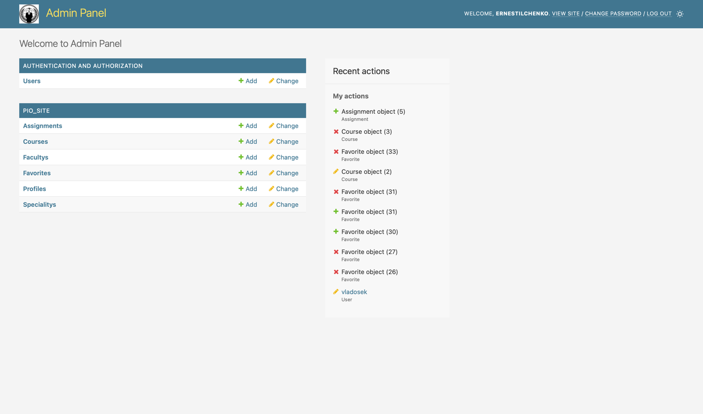
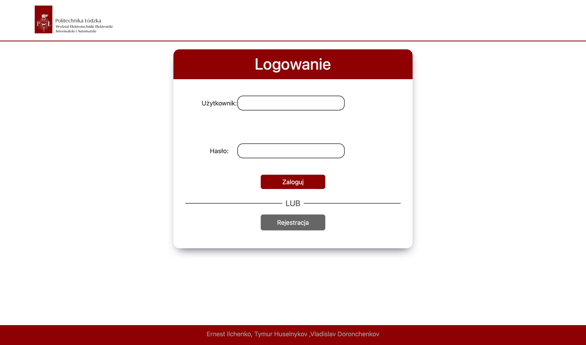
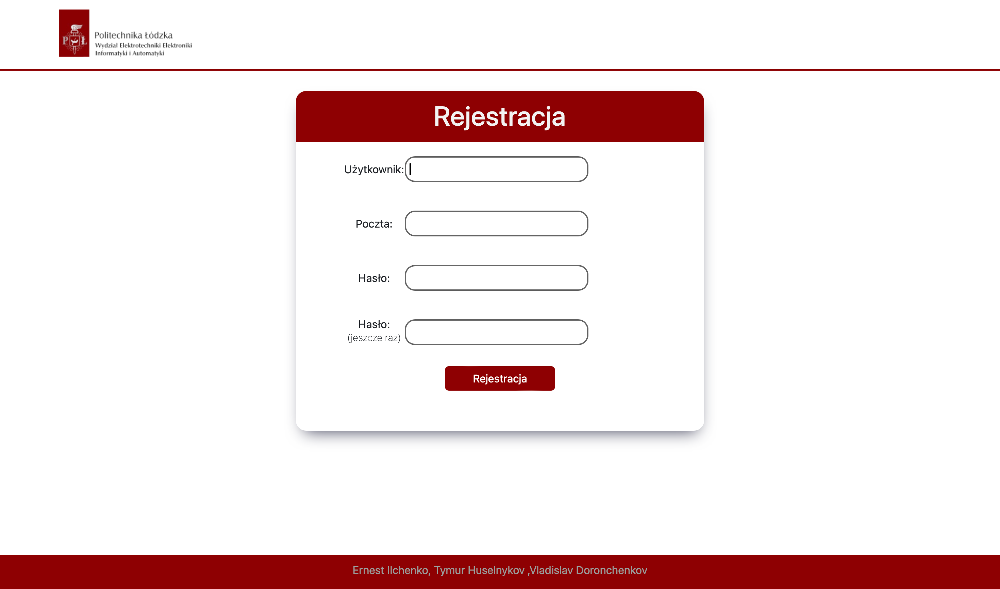
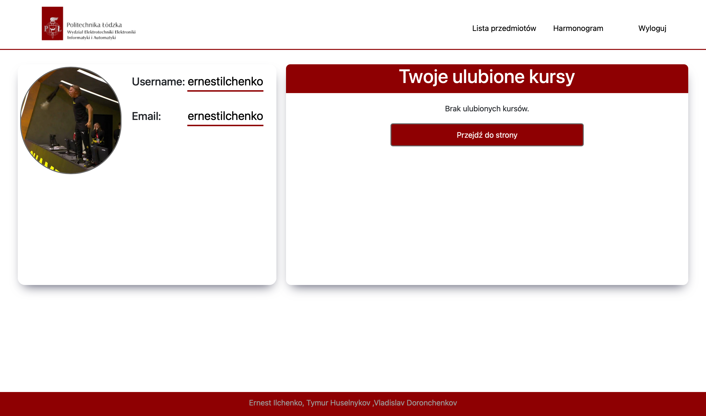
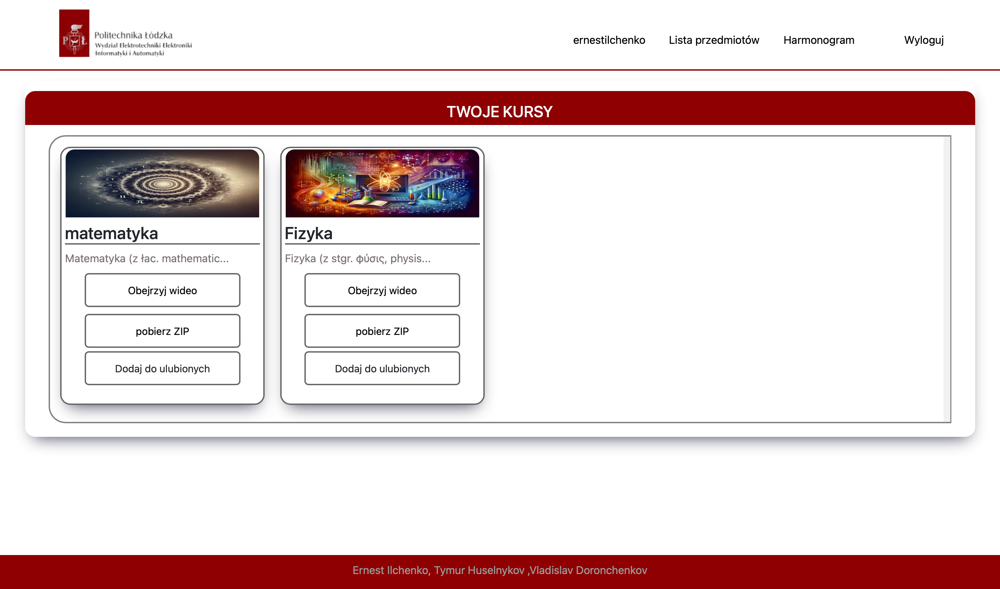
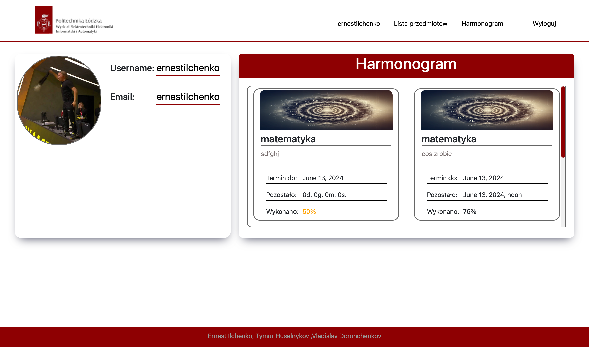

## Instalacja

## 1. Zainstaluj Python 3.12.0

Pobierz i zainstaluj Python 3.12.0 z oficjalnej strony:
[Python 3.12.0 Download](https://www.python.org/downloads/release/python-3120/)

## 2. Utwórz środowisko wirtualne

Otwórz terminal i utwórz środowisko wirtualne za pomocą następującego polecenia:

```sh
python<version> -m venv <virtual-environment-name>
```

## 3.Należy wykonać następujące polecenia

```sh
 mkdir pioproject
 cd pioproject
 python3.8 -m venv env
```
## 4.Należy sklonować projekt z github
```sh
git clone https://github.com/ernestilchenko/pioproject.git
```

## 5.Należy zainstalować bibliotekę

```sh
pip install -r requirements.txt
```


## Urochomienie
Żeby urochomić serwer, znajdując się w folderze z projektem, należy wywolać następne polecenie

```sh
python manage.py runserver
```


## Oto wszystkie dostępne strony 

```python
urlpatterns = [
    path('register/', views.register_view, name='register'),
    path('login/', views.login_view, name='login'),
    path('favorites/add/<int:course_id>/', add_to_favorites, name='add_to_favorites'),
    path('favorites/', views.course_list, name='favorites_list'),
    path('favorites/add/<int:course_id>/', views.add_to_favorites, name='add_to_favorites'),
    path('courses/delete_course/<int:course_id>/', views.delete_course, name='delete_course'),
    path('logout/', views.logout, name='logout'),
    path('courses/', views.select_faculty_and_speciality_and_favorites_list, name='faculty_list'),
    path('harmonogram/', views.harmonogram, name='harmonogram'),
    path('course/', views.course, name='course'),
    path('harmonogram/', views.harmonogram, name='harmonogram'),
    path('course/<int:course_id>/', views.course_detail, name='course_detail'),
    path('admin/', admin_site.urls, name='admin_site')
]
```


## Opis:

Strona administratora umożliwia przeglądanie bazy danych, wprowadzanie zmian i dodawanie nowych kursów. Aby wprowadzić zmiany, wybierz model po lewej stronie, a następnie przejdź do żądanego rekordu, klikając pierwszą kolumnę rekordu. Po wprowadzeniu zmian, zapisz je na dole. Możesz także dodać wpis w prawym górnym rogu każdego modelu.

## Dostępne są cztery modele:
- Użytkownicy (login, hasło (szyfrowane), imię, nazwisko, e-mail, prawa dostępu itp.)
- Profile użytkowników (dane w zależności od typu użytkownika (można zmienić awatar użytkownika))
- Hamonogram (powiązany z kursem, tytułem, opisem, datą rozpoczęcia i zakończenia) przypisany do użytkownika lub grupy.
- Kursy - (można utworzyć kurs, powiązać z nim wideo, opis, przydatne materiały i dodać do ulubionych kursów użytkownika lub usunąć) 

## Strona administratora


```http
http://127.0.0.1:8000/pio/admin
```


## Strona logowania
```http
http://127.0.0.1:8000/pio/login
```

## Strona rejestracji
```http
http://127.0.0.1:8000/pio/register
```

## Strona użytkownika
```http
http://127.0.0.1:8000/pio/courses
```
Tutaj możemy zmienić avatar i dodać kursy


## Strona z kursami
```http
http://127.0.0.1:8000/pio/favorites
```
Tutaj możemy dodawać kursy do ulubionych, oglądać filmy, pobierać pliki pomocy i opisy.


## Strona z hamonogramem
```http
http://127.0.0.1:8000/pio/hamonogram
```
Tutaj nauczyciel może wprowadzić termin przez administrację, gdy uczeń musi wykonać zadanie.  


## Authors

- [@ernestilchenko](https://www.github.com/ernestilchenko)
- [@Ajeszny](https://github.com/Ajeszny)
- [@Andezio](https://github.com/Andezion)

